# 웹 프레임워크 과제 1
1991148 박정제
## 환경설정
- Spring Boot 3.2.4
- build tool : Gradle
- java 17
- RDBMS : H2 (embedded)
- template engine : Thymeleaf
- ORM : Spring Data JPA
- Spring Security
- Lombok
- Validation

<!-- TOC -->
* [웹 프레임워크 과제 1](#웹-프레임워크-과제-1)
  * [환경설정](#환경설정)
* [1](#1)
  * [본인이 지금까지 수강한 교과목을 Courses 테이블에 저장한다](#본인이-지금까지-수강한-교과목을-courses-테이블에-저장한다)
  * [그리고 사용자 계정 정보는 Users, Authorities 테이블에 저장한다](#그리고-사용자-계정-정보는-users-authorities-테이블에-저장한다)
* [2](#2)
  * [학사 정보 시스템에 대한 홈페이지를 작성한다.](#학사-정보-시스템에-대한-홈페이지를-작성한다)
  * [이 때 홈페이지는 누구나 접근 가능하며, 학사 정보 접근은 반드시 로그인을 수행한 후, 접근할 수 있다.](#이-때-홈페이지는-누구나-접근-가능하며-학사-정보-접근은-반드시-로그인을-수행한-후-접근할-수-있다)
* [3](#3)
  * [학사 정보 접근시 인증 유무를 체크한다.](#학사-정보-접근시-인증-유무를-체크한다)
  * [미인증시 인증을 위한 Custom 로그인 폼(username, password)을 디스플레이한다. 이 때 로그인 폼은 스프링에서 제공하는 UI (User Interface)가 아니라 자체적으로 작성한다.](#미인증시-인증을-위한-custom-로그인-폼username-password을-디스플레이한다-이-때-로그인-폼은-스프링에서-제공하는-ui-user-interface가-아니라-자체적으로-작성한다)
* [4](#4)
  * ['학년별 이수 학점 조회' 시 학기별 이수 총 학점을 보여준다. 이 때 반드시 총계도 표시한다.](#학년별-이수-학점-조회-시-학기별-이수-총-학점을-보여준다-이-때-반드시-총계도-표시한다)
  * [‘수강 신청하기’ 메뉴 선택시, 2024년 2학기에 신청할 교과목을 웹 폼을 통해 입력 받은후 DB에 저장한다. 이 때 사용자가 입력한 데이터에 대한 오류 검증 작업을 반드시 실시하고 수강 신청 교과목을 DB에 저장한다.](#수강-신청하기-메뉴-선택시-2024년-2학기에-신청할-교과목을-웹-폼을-통해-입력-받은후-db에-저장한다-이-때-사용자가-입력한-데이터에-대한-오류-검증-작업을-반드시-실시하고-수강-신청-교과목을-db에-저장한다)
  * [‘수강 신청 조회” 메뉴를 통해 2024 년 2 학기 수강 신청 내역을 디스플레이한다.](#수강-신청-조회-메뉴를-통해-2024-년-2-학기-수강-신청-내역을-디스플레이한다-)
<!-- TOC -->

# 1

## 본인이 지금까지 수강한 교과목을 Courses 테이블에 저장한다
Course.java
```java
@Entity
@Table(name = "courses")
@Data
public class Course {

    @Id
    @GeneratedValue(strategy = GenerationType.IDENTITY)
    private Long id;

    @Column(name = "year_of_study")
    private Long year;

    private Long semester;

    private String code;

    private String name;

    private String type;

    private String professor;

    private Long credits;
}
```

CourseRepository.java
```java
public interface CourseRepository extends JpaRepository<Course, Long> {
    List<Course> findByYearAndSemester(Long year, Long semester);
}
```

실제 데이터베이스 내부
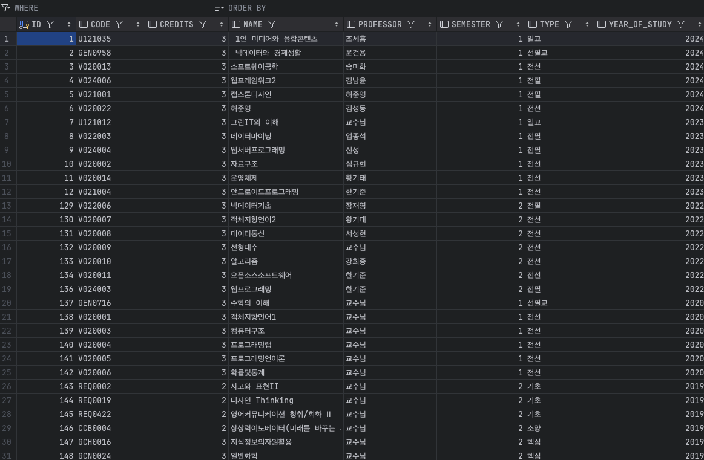

## 그리고 사용자 계정 정보는 Users, Authorities 테이블에 저장한다

User.java
```java
@Entity
@Table(name = "users")
@Data
public class User {

    @Id
    private String username;

    @Column(nullable = false)
    private String password;

    @Column(nullable = false)
    private String email;
}
```

UserRepository.java
```java
public interface UserRepository extends JpaRepository<User, String> {
    User findByUsername(String username);

    boolean existsByUsername(String username);
}
```

데이터베이스 내부
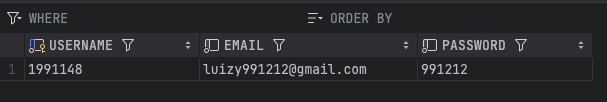

Authority.java
```java
@Entity
@Table(name = "authoritys")
@Data
public class Authority {

    @Id
    @GeneratedValue(strategy = GenerationType.IDENTITY)
    private Long id;

    @OneToOne
    private User user;

    private String authority = "ROLE_USER";
}
```

AuthorityRepository.java
```java
public interface AuthorityRepository extends JpaRepository<Authority, Long> {
    Authority findByUser(User user);
}
```

데이터베이스 내부
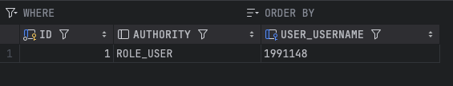


테이블 관계
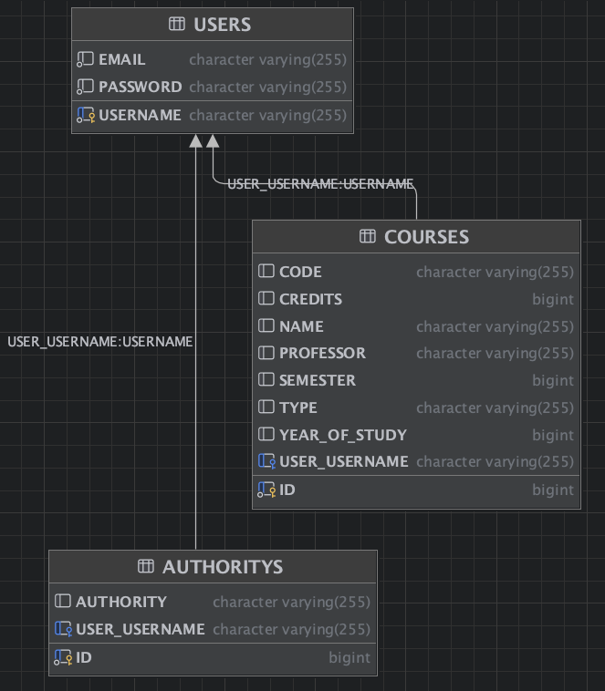

# 2
## 학사 정보 시스템에 대한 홈페이지를 작성한다.
학사 정보 접근 메뉴는 

① 학년별 이수 학점 조회,

② 수강 신청하기,

③ 수강 신청 조회가 있다.

타임리프 템플릿 엔진으로 구성

index.html
```html
<!DOCTYPE html>
<html xmlns:th="http://www.thymeleaf.org">
<head>
    <meta charset="UTF-8">
    <title>학사 정보 시스템</title>
    <link rel="stylesheet" href="https://cdn.jsdelivr.net/npm/bootstrap@5.3.2/dist/css/bootstrap.min.css" integrity="sha384-T3c6CoIi6uLrA9TneNEoa7RxnatzjcDSCmG1MXxSR1GAsXEV/Dwwykc2MPK8M2HN" crossorigin="anonymous">
</head>
<body>

<nav class="navbar navbar-expand navbar-light bg-light">
    <div class="container">
        <a class="navbar-brand" href="#">학사 정보 시스템</a>
        <div class="navbar-nav">
            <a class="nav-link" th:href="@{/login}">로그인</a>
        </div>
    </div>
</nav>

<div class="container mt-5">
    <h1 class="mb-3">학사 정보 시스템 홈페이지</h1>
    <div class="list-group">
        <a href="#" class="list-group-item list-group-item-action" th:href="@{/courses}">학년별 이수 학점 조회</a>
        <a href="#" class="list-group-item list-group-item-action" th:href="@{/courses/add}">수강 신청하기</a>
        <a href="#" class="list-group-item list-group-item-action" th:href="@{/courses/2024/2}">수강 신청 조회</a>
    </div>
</div>

</body>
</html>
```
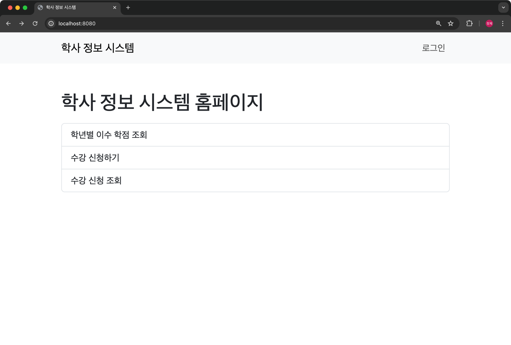

## 이 때 홈페이지는 누구나 접근 가능하며, 학사 정보 접근은 반드시 로그인을 수행한 후, 접근할 수 있다.
Spring Security를 이용하여 구현

SecurityConfig.java
```java
@Slf4j
@Configuration
@EnableWebSecurity
public class SecurityConfig {

    @Bean
    public SecurityFilterChain securityFilterChain(HttpSecurity http) throws Exception {
        http
                .authorizeHttpRequests((authorize) -> authorize
                        .requestMatchers("/", "/login", "/register", "/logout").permitAll() // permitAll() : 모든 사용자에게 허용
                        .anyRequest().authenticated()
                )
                .formLogin((formLogin) -> formLogin
                        .loginPage("/login")
                        .loginProcessingUrl("/login")
                        .defaultSuccessUrl("/", true)
                        .failureUrl("/login?error=true")
                );

        return http.build();
    }

    @Bean
    public PasswordEncoder passwordEncoder() {
        return NoOpPasswordEncoder.getInstance();
    }

}
```

"/", "/login", "/register", "/logout"는 모든 사용자에게 허용하고, 나머지는 인증된 사용자만 접근 가능하도록 설정

로그인이 안된 상태에서 학사 정보 접근 메뉴를 클릭하면 로그인 페이지로 이동

# 3
## 학사 정보 접근시 인증 유무를 체크한다.
위 SecurityConfig.java에서 설정한대로 학사 정보 접근시 인증 유무를 체크한다.


## 미인증시 인증을 위한 Custom 로그인 폼(username, password)을 디스플레이한다. 이 때 로그인 폼은 스프링에서 제공하는 UI (User Interface)가 아니라 자체적으로 작성한다.

loginForm.html
```html
<!DOCTYPE HTML>
<html xmlns:th="http://www.thymeleaf.org">
<head>
    <meta charset="utf-8">
    <link rel="stylesheet" href="https://cdn.jsdelivr.net/npm/bootstrap@5.3.2/dist/css/bootstrap.min.css" integrity="sha384-T3c6CoIi6uLrA9TneNEoa7RxnatzjcDSCmG1MXxSR1GAsXEV/Dwwykc2MPK8M2HN" crossorigin="anonymous">
</head>
<body>

<div class="container">

    <div class="py-5 text-center">
        <h2>로그인</h2>
    </div>

    <form action="/" th:action="@{/login}" th:object="${user}" method="post">


        <div th:if="${error}" class="alert alert-danger">
            아이디 또는 비밀번호가 틀렸습니다.
        </div>

        <div th:if="${#fields.hasGlobalErrors()}">
            <p class="field-error" th:each="err : ${#fields.globalErrors()}" th:text="${err}">전체 오류 메시지</p>
        </div>

        <div>
            <label for="username">로그인 ID</label>
            <input type="text" id="username" th:field="*{username}" class="form-control"
                   th:errorclass="field-error">
            <div class="field-error" th:errors="*{username}">
            </div>
        </div>
        <div>
            <label for="password">비밀번호</label>
            <input type="password" id="password" th:field="*{password}" class="form-control"
                   th:errorclass="field-error">
            <div class="field-error" th:errors="*{password}">
            </div>
        </div>

        <hr class="my-4">

        <div class="row">
            <div class="col">
                <button class="w-100 btn btn-primary btn-lg" type="submit">로그인</button>
            </div>
            <div class="col">
                <button class="w-100 btn btn-secondary btn-lg" onclick="location.href='/register'"
                        th:onclick="|location.href='@{/register}'|"
                        type="button">회원가입</button>
            </div>
        </div>

    </form>

</div> <!-- /container -->
</body>
</html>
```

로그인 페이지
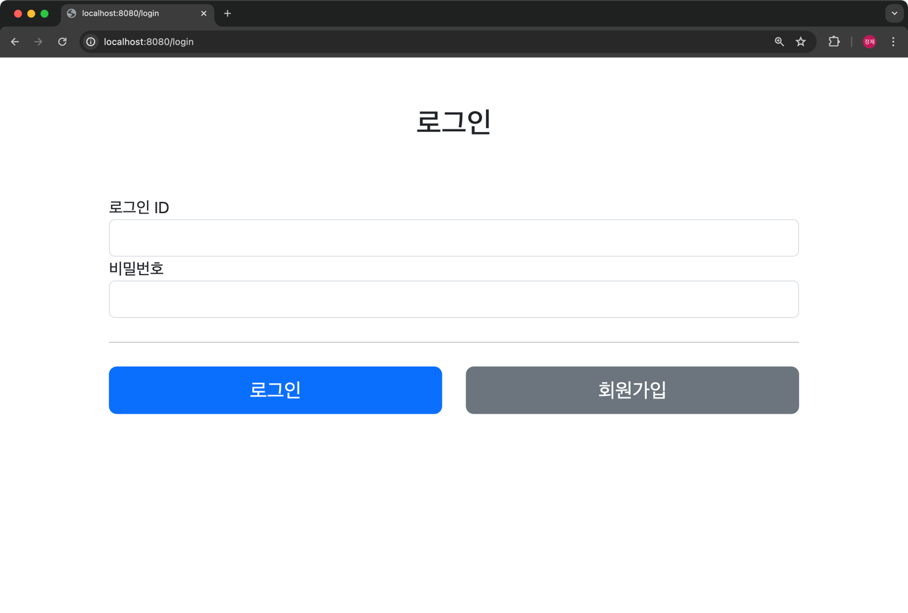

회원가입 페이지 구현

addUserForm.html
```html
<!DOCTYPE HTML>
<html xmlns:th="http://www.thymeleaf.org">
<head>
    <meta charset="utf-8">
    <link rel="stylesheet" href="https://cdn.jsdelivr.net/npm/bootstrap@5.3.2/dist/css/bootstrap.min.css" integrity="sha384-T3c6CoIi6uLrA9TneNEoa7RxnatzjcDSCmG1MXxSR1GAsXEV/Dwwykc2MPK8M2HN" crossorigin="anonymous">
</head>
<body>

<div class="container">

    <div class="py-5 text-center">
        <h2>회원 가입</h2>
    </div>

    <h4 class="mb-3">회원 정보 입력</h4>

    <form action="" th:action="@{/register}" th:object="${user}" method="post">

        <div th:if="${#fields.hasGlobalErrors()}">
            <p class="field-error" th:each="err : ${#fields.globalErrors()}" th:text="${err}">전체 오류 메시지</p>
        </div>

        <div>
            <label for="username">로그인 ID</label>
            <input type="text" id="username" th:field="*{username}" class="form-control"
                   th:errorclass="field-error">
            <div class="field-error" th:errors="*{username}" />
        </div>
        <div>
            <label for="email">email</label>
            <input type="text" id="email" th:field="*{email}" class="form-control"
                   th:errorclass="field-error">
            <div class="field-error" th:errors="*{email}" />
        </div>
        <div>
            <label for="password">비밀번호</label>
            <input type="password" id="password" th:field="*{password}" class="form-control"
                   th:errorclass="field-error">
            <div class="field-error" th:errors="*{password}" />
        </div>
        <div>
            <label for="passwordConfirm">비밀번호 확인</label>
            <input type="password" id="passwordConfirm" th:field="*{passwordConfirm}" class="form-control"
                   th:errorclass="field-error">
            <div class="field-error" th:errors="*{passwordConfirm}" />
        </div>
        <hr class="my-4">

        <div class="row">
            <div class="col">
                <button class="w-100 btn btn-primary btn-lg" type="submit">회원 가입</button>
            </div>
            <div class="col">
                <button class="w-100 btn btn-secondary btn-lg" onclick="location.href='index.html'"
                        th:onclick="|location.href='@{/login}'|"
                        type="button">취소</button>
            </div>
        </div>

    </form>

</div> <!-- /container -->
</body>
</html>
```

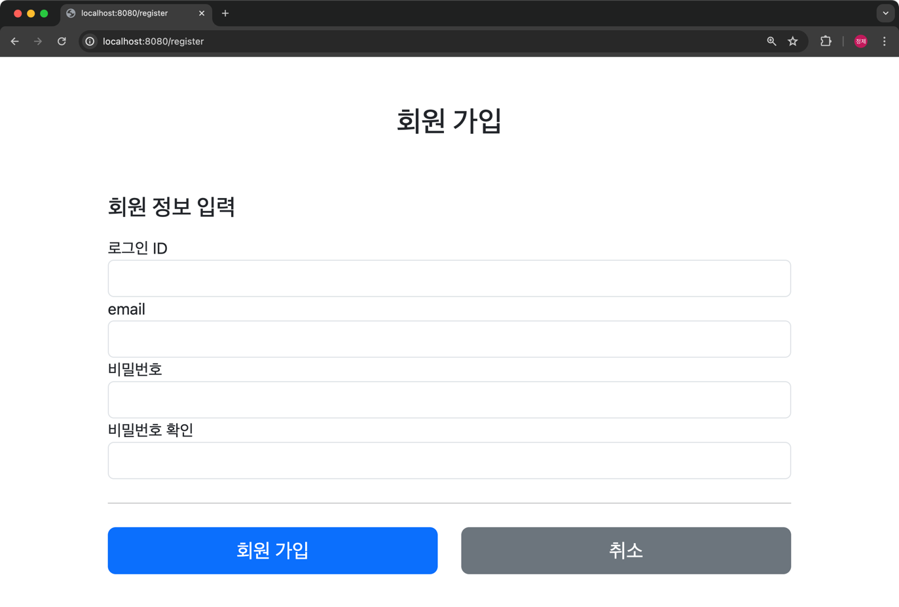


검증을 통해 오류가 발생하면 오류 메시지를 출력

UserAddDto.java
```java
@Data
public class UserAddDto {

    @NotBlank
    private String username;

    @Email
    private String email;

    @NotBlank
    private String password;

    @NotBlank
    private String passwordConfirm;
}
```

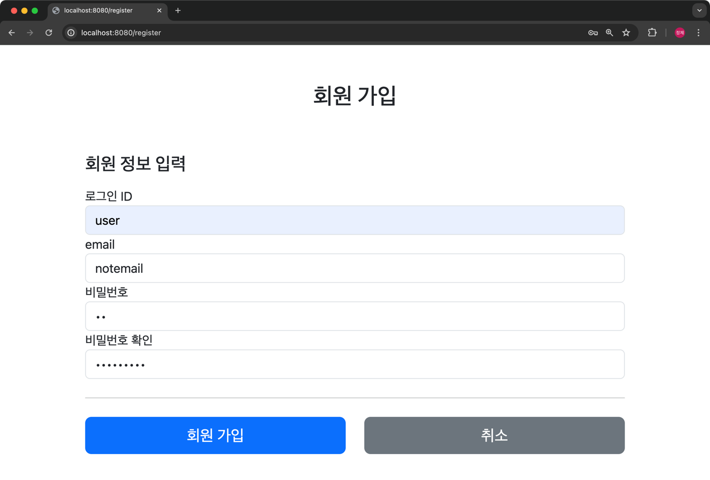
->
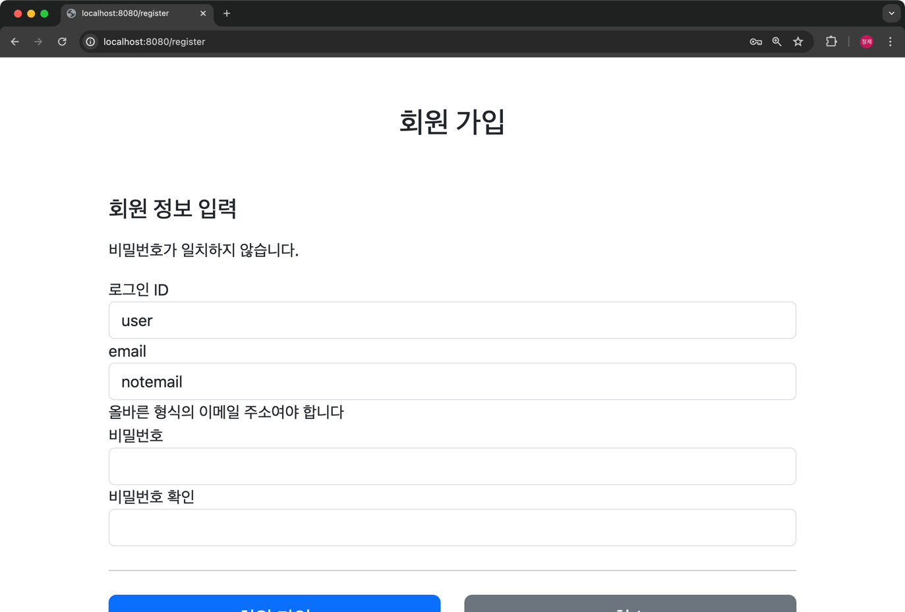

작성중이던 내용은 유지됩니다

# 4
## '학년별 이수 학점 조회' 시 학기별 이수 총 학점을 보여준다. 이 때 반드시 총계도 표시한다.
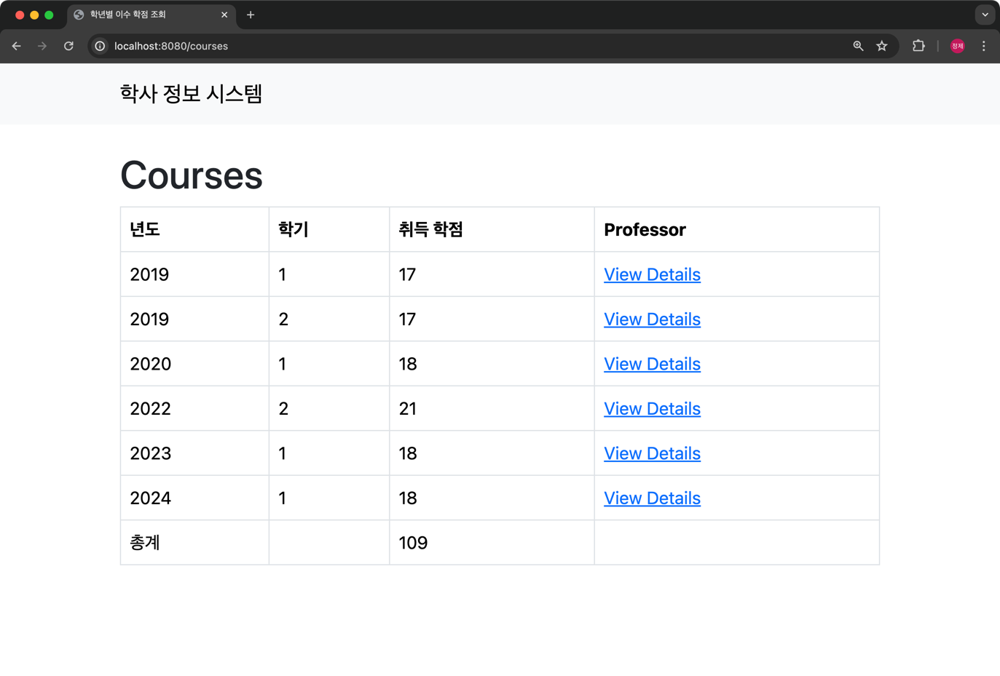

타임리프 템플릿 엔진을 사용해서 모델로 전달받은 내용을 출력

```java
public List<Course> findAllCreditsSum() {
    List<Course> courses = courseRepository.findAll();

    List<Course> result = new ArrayList<>();

    loop :
    for (Course course : courses) {
        long courseYear = course.getYear();
        long courseSemester = course.getSemester();

        if (courseYear >= NEXT_SEMESTER_YEAR && courseSemester >= NEXT_SEMESTER) {
            continue;
        }

        for (Course resultCourse : result) {
            if (resultCourse.getYear().equals(courseYear) && resultCourse.getSemester().equals(courseSemester)) {
                resultCourse.setCredits(resultCourse.getCredits() + course.getCredits());
                continue loop;
            }
        }
        result.add(course);
    }

    result.sort((o1, o2) -> {
        if (o1.getYear().equals(o2.getYear())) {
            return o1.getSemester().compareTo(o2.getSemester());
        }
        return o1.getYear().compareTo(o2.getYear());
    });

    return result;
}
```
courses.html
```html
<!DOCTYPE html>
<html xmlns:th="http://www.thymeleaf.org">
<head>
    <meta charset="UTF-8">
    <title>학년별 이수 학점 조회</title>
    <link rel="stylesheet" href="https://cdn.jsdelivr.net/npm/bootstrap@5.3.2/dist/css/bootstrap.min.css" integrity="sha384-T3c6CoIi6uLrA9TneNEoa7RxnatzjcDSCmG1MXxSR1GAsXEV/Dwwykc2MPK8M2HN" crossorigin="anonymous">
</head>
<body>

<nav class="navbar navbar-expand navbar-light bg-light">
    <div class="container">
        <a class="navbar-brand" href="/">학사 정보 시스템</a>
    </div>
</nav>

<div class="container mt-4">
    <h1>Courses</h1>
    <table class="table table-bordered">
        <thead>
        <tr>
            <th>년도</th>
            <th>학기</th>
            <th>취득 학점</th>
            <th>Professor</th>
        </tr>
        </thead>
        <tbody>
        <tr th:each="course : ${courses}">
            <td th:text="${course.year}">년도</td>
            <td th:text="${course.semester}">학기</td>
            <td th:text="${course.credits}">취득 학점</td>
            <td>
                <a th:href="@{/courses/{year}/{semester}(year=${course.year}, semester=${course.semester})}">
                    View Details
                </a>
            </td>
        </tr>
        <tr>
            <td>총계</td>
            <td></td>
            <td th:text="${sum}">총계</td>
            <td></td>
        </tr>
        </tbody>
    </table>
</div>
</body>
</html>
```

상세보기 페이지
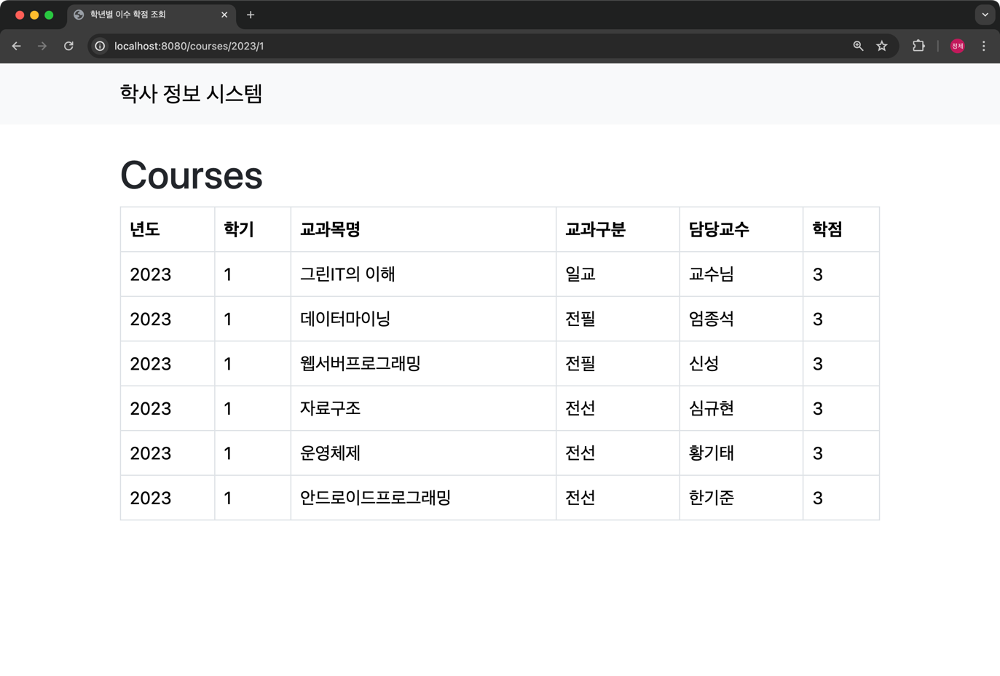

```java
public List<Course> findByYearAndSemester(Long year, Long semester) {
    return courseRepository.findByYearAndSemester(year, semester);
}
```
coursesDetail.html
```html
<!DOCTYPE html>
<html xmlns:th="http://www.thymeleaf.org">
<head>
    <meta charset="UTF-8">
    <title>학년별 이수 학점 조회</title>
    <link rel="stylesheet" href="https://cdn.jsdelivr.net/npm/bootstrap@5.3.2/dist/css/bootstrap.min.css" integrity="sha384-T3c6CoIi6uLrA9TneNEoa7RxnatzjcDSCmG1MXxSR1GAsXEV/Dwwykc2MPK8M2HN" crossorigin="anonymous">
</head>
<body>
<nav class="navbar navbar-expand navbar-light bg-light">
    <div class="container">
        <a class="navbar-brand" href="/">학사 정보 시스템</a>
    </div>
</nav>
<div class="container mt-4">
    <h1>Courses</h1>
    <table class="table table-bordered">
        <thead>
        <tr>
            <th>년도</th>
            <th>학기</th>
            <th>교과목명</th>
            <th>교과구분</th>
            <th>담당교수</th>
            <th>학점</th>
        </tr>
        </thead>
        <tbody>
        <tr th:each="course : ${courses}">
            <td th:text="${course.year}">년도</td>
            <td th:text="${course.semester}">학기</td>
            <td th:text="${course.name}">교과목명</td>
            <td th:text="${course.type}">교과구분</td>
            <td th:text="${course.professor}">담당교수</td>
            <td th:text="${course.credits}">학점</td>
        </tr>
        </tbody>
    </table>
</div>
</body>
</html>
```

## ‘수강 신청하기’ 메뉴 선택시, 2024년 2학기에 신청할 교과목을 웹 폼을 통해 입력 받은후 DB에 저장한다. 이 때 사용자가 입력한 데이터에 대한 오류 검증 작업을 반드시 실시하고 수강 신청 교과목을 DB에 저장한다.

수강 신청 페이지
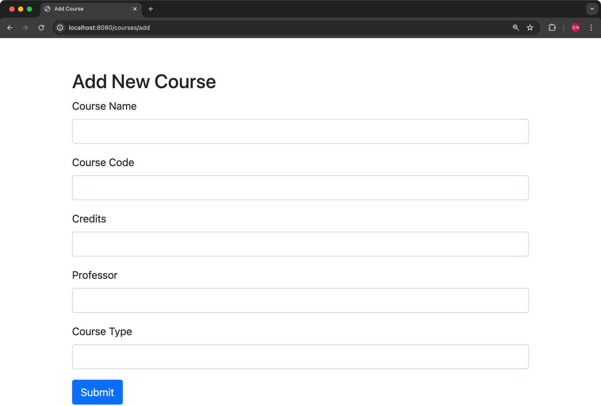

Dto를 통해 데이터를 전달
검증 정보 추가
학점은 5가 넘지 않도록 설정

CourseAddDto.java
```java
@Data
public class CourseAddDto {
    @NotBlank
    private String code;

    @NotBlank
    private String name;

    @NotBlank
    private String type;

    @NotBlank
    private String professor;

    @NotNull
    @Range(min = 1, max = 10)
    private Long credits;
}
```

잘못된 정보를 입력할 경우 오류 메시지 출력
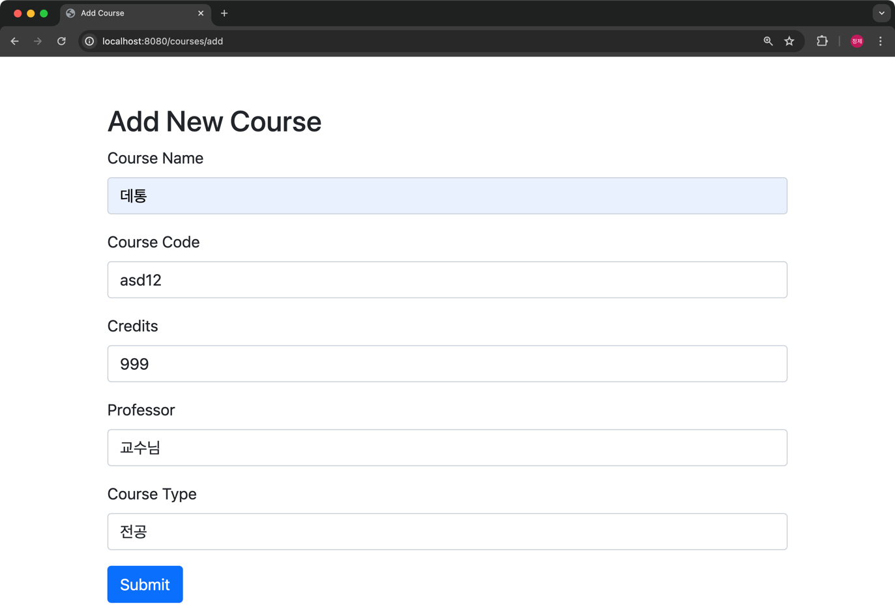
->
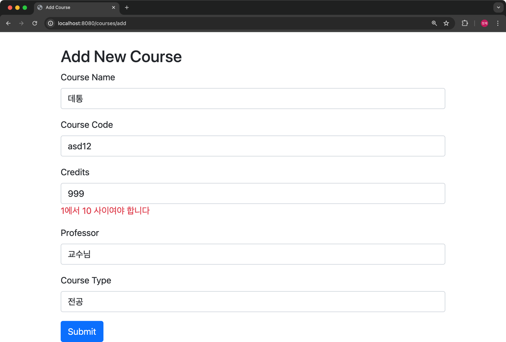

성공할 경우 데이터베이스에 저장
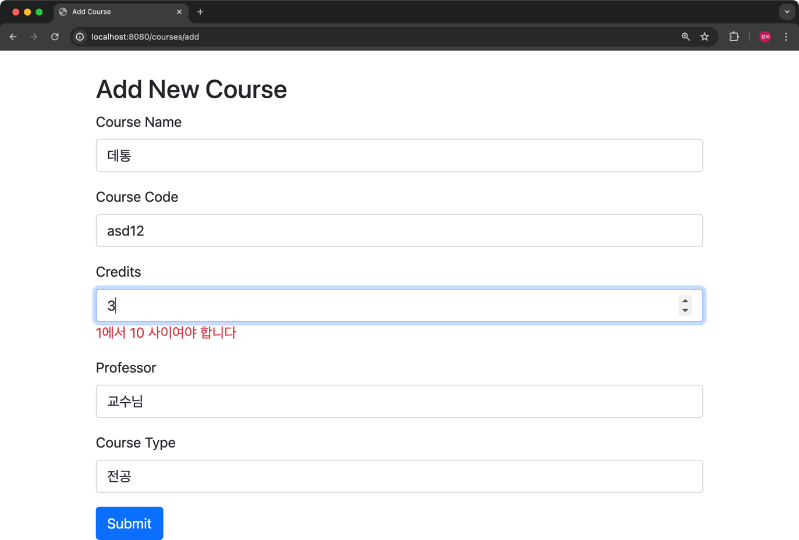
->
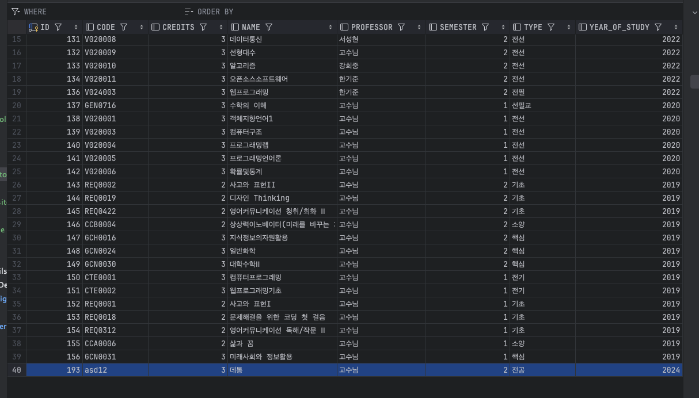

## ‘수강 신청 조회” 메뉴를 통해 2024 년 2 학기 수강 신청 내역을 디스플레이한다. 

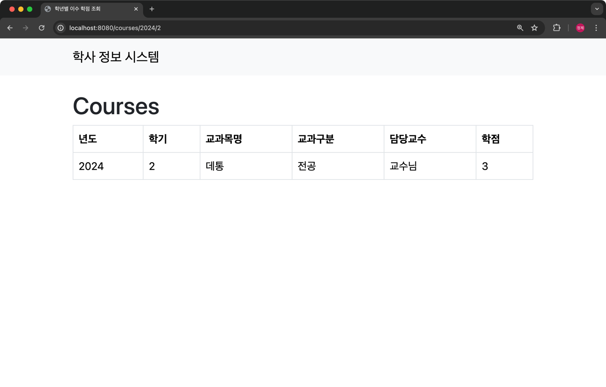